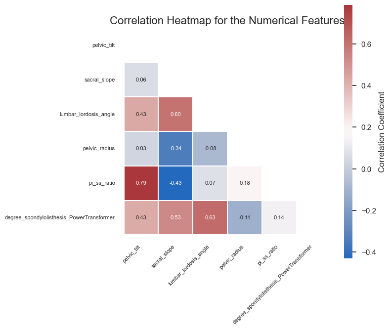
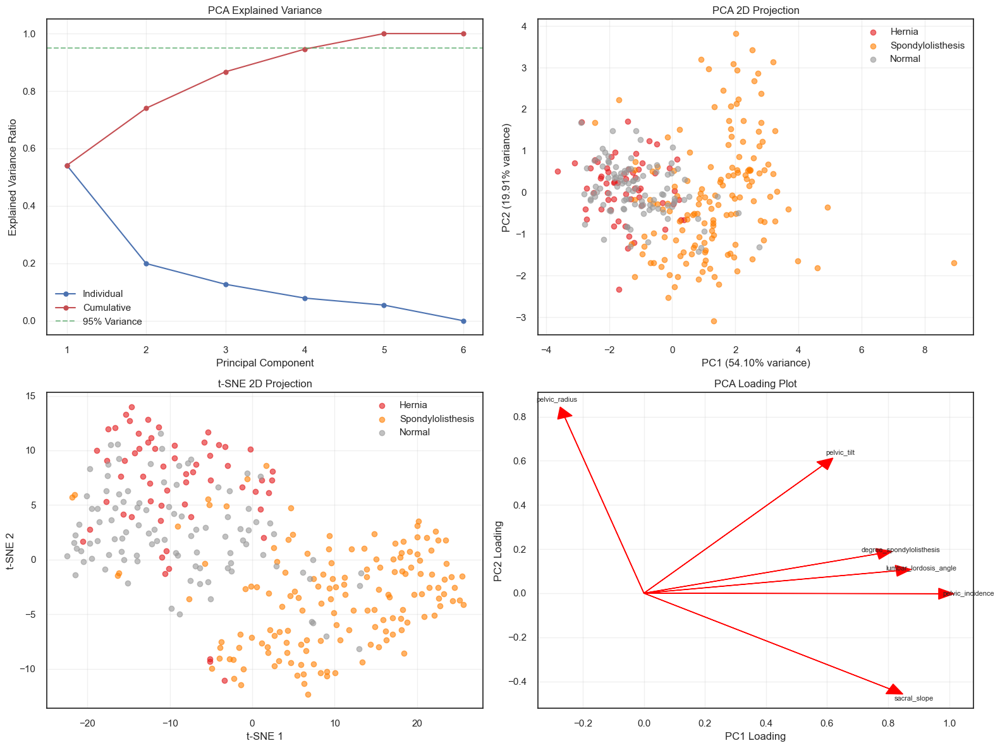

# 📄 SpineScope – My Project Journey  
**Track:** 🔴 Advanced | **Role:** Data Science Explorer  

Welcome to my SpineScope project report!  
This was a challenging and rewarding experience that pushed me to think critically, explore data deeply, and make modeling decisions like a real-world data scientist. This write-up captures my journey through each phase — from asking the right questions to building and refining predictive models for spinal health.

---

## ✅ Phase 1: Setup & Exploratory Data Analysis (EDA)

This phase was all about understanding the dataset. I focused on quality, patterns, relationships, and potential red flags before modeling anything.

### 🔑 Q1: Which features are most strongly linked to spinal abnormalities?

After running statistical tests and digging into feature interactions, I found all  biomechanical features with strong signals:

| Feature                    | F-Statistic | P-Value | Effect Size | Significant |
|----------------------------|-------------|---------|-------------|-------------|
| `pelvic_incidence`         | 98.54       | 0.0     | 0.243       | ✅ Yes       |
| `pelvic_tilt`              | 21.30       | 0.0     | 0.065       | ✅ Yes       |
| `lumbar_lordosis_angle`    | 114.98      | 0.0     | 0.272       | ✅ Yes       |
| `sacral_slope`             | 89.64       | 0.0     | 0.226       | ✅ Yes       |
| `pelvic_radius`            | 16.87       | 0.0     | 0.052       | ✅ Yes       |
| `degree_spondylolisthesis` | 119.12      | 0.0     | 0.280       | ✅ Yes       |

These results confirmed my suspicion that spinal alignment and posture measurements are key indicators.

---

### 🔑 Q2: Any strong linear relationships?

This heatmap shows pairwise correlations among numerical features, masked for the upper triangle.

A couple stood out for very high correlation with each other:

| Feature Pair                               | Correlation (r) |
|--------------------------------------------|------------------|
| `pelvic_incidence` ↔ `lumbar_lordosis_angle` | 0.717            |
| `pelvic_incidence` ↔ `sacral_slope`          | 0.815            |

These strong correlations hinted at redundancy and potential multicollinearity — something I’d need to address later.

---

### 🔑 Q3: Do features cluster based on spinal health?

I tried PCA and t-SNE to visualize whether biomechanical features naturally separated different spinal conditions. The results:

- 🧭 **PCA** showed some separation, but not enough for clean clusters.
- 🌈 **t-SNE** gave better visual hints, but overlap remained.
- 🧩 Conclusion: There's some pattern, but no hard boundaries between conditions.

---

### 🔑 Q4: Any multicollinearity issues?

Oh yes — big ones! Some features had extremely high VIFs:

| Feature                 | VIF     |
|------------------------|---------|
| `pelvic_incidence`     | ∞       |
| `pelvic_tilt`          | ∞       |
| `lumbar_lordosis_angle`| 18.94   |
| `sacral_slope`         | ∞       |
| `pelvic_radius`        | 12.28   |

📌 I made note to simplify the feature set and avoid confusing the model later.

---

## ✅ Phase 2: Model Development

### 📆 Week 1: Feature Engineering & Preprocessing

This was one of my favorite parts — transforming raw data into something models could learn from.

---

### 🔑 Q1: Handling categorical features

- `class` had only 3 values: Normal, Hernia, and Spondylolisthesis.  
- I used simple one-hot encoding (or LabelEncoder when needed).  
- No need for fancy embeddings here — low cardinality made this easy.

---

### 🔑 Q2: Which features seem most predictive?
There were clear differences of features in different spinal conditions from the plots. 

Based on plots and feature importance analysis, I ranked them like this:

| Feature                    | Why It Matters |
|----------------------------|----------------|
| `degree_spondylolisthesis` | Clear signal for Spondylolisthesis |
| `pelvic_incidence`         | Elevated for Spondylolisthesis |
| `pelvic_tilt`              | Varies clearly across classes |
| `sacral_slope`             | Moderate separation |
| `lumbar_lordosis_angle`    | Some overlap, but useful |
| `pelvic_radius`            | Noisy — not so helpful |

Visuals like boxplots and violin plots really helped guide these insights.

---

### 🔑 Q3: What needed scaling?

I checked distribution shapes and used:

| Scenario                     | Scaler Used      |
|------------------------------|------------------|
| Normal-ish distributions     | `StandardScaler` |
| Highly skewed features       | Log-transform + scale |

`degree_spondylolisthesis` was very skewed, so I will log-transform it first and apply StandardScaler() for all features and by this degree_spondlylolistethis will be scaled twice.

---

### 🔑 Q4: Did I create new features?

✅ Yes — and I’m proud of this one!

- **New Feature:** `pi_ss_ratio`  
- **Formula:** `pelvic_incidence / sacral_slope`  
- **Why:** This ratio captures the relationship between spine structure and posture. It helped reduce redundancy *and* added interpretability.

---

### 🔑 Q5: Features I dropped

To simplify the model and reduce multicollinearity:

- **Dropped:** `pelvic_incidence`  
- **Replaced with:** `pi_ss_ratio`  
- **Justification:** `pelvic_incidence` was heavily correlated with other features. The new ratio retained its influence without the mess.

---

### 🔑 Q6: Final schema + class balance

**Input Features:**

- `pelvic_tilt`, `sacral_slope`, `lumbar_lordosis_angle`,  
  `pelvic_radius`, `degree_spondylolisthesis`, `pi_ss_ratio`

**Target:** `class` or `binary_class`

**Class Distribution:**

| Class             | Count | %     |
|-------------------|-------|-------|
| Spondylolisthesis | 150   | 48.4% |
| Normal            | 100   | 32.3% |
| Hernia            | 60    | 19.4% |

⚠️ **Imbalance ratio:** ~2.5  
To handle this, I will explored:

- 🔁 SMOTE / oversampling  
- ⚖️ Class weighting  
- 🎯 Focal loss — to help with harder-to-classify examples

---

### 📆 Week 2 & 3: Model Building & Tuning

---

## ✅ Phase 3: Model Deployment

---

### 🔑 Q1: What neural network architecture did I implement (input shape, number of hidden layers, activation functions, etc.), and what guided my design choices?
🎯 Purpose: Tests ability to structure an FFNN for classification and explain architectural decisions.

💡 Hint:
- Describe your model layers: e.g., [Input → Dense(64) → ReLU → Dropout → Dense(32) → ReLU → Output(sigmoid)].
- Justify the number of layers/units based on dataset size and complexity.
- Explain why ReLU and sigmoid are appropriate.

- **Architecture**:
  - Input Layer → Dense(128) → BatchNorm → ReLU → Dropout(0.3) →  
  - Dense(64) → BatchNorm → ReLU → Dropout(0.3) →  
  - Dense(32) → BatchNorm → ReLU → Dropout(0.3) →  
  - Output Layer (Sigmoid for binary classification)

- **Input Shape**: Equal to the number of numeric features (e.g., 6 biomechanical measurements).

- **Guiding Principles**:
  - **Depth & Units**: The 3-layer architecture (128→64→32) was selected to gradually reduce complexity and allow the network to learn hierarchical feature representations without overfitting the relatively small dataset.
  - **Activation Functions**: ReLU was chosen for hidden layers to mitigate vanishing gradient problems, improving convergence speed. A sigmoid output was used because the task is binary classification.
  - **Regularization**: Dropout and Batch Normalization were implemented to reduce overfitting and accelerate training convergence, respectively.

---

### 🔑 Q2: What metrics did you track during training and evaluation (e.g., accuracy, precision, recall, F1-score, AUC), and how did your model perform on the validation/test set?
🎯 Purpose: Tests metric understanding for classification and ability to interpret model quality.

💡 Hint:
- Log and compare metrics across epochs using validation data.
- Plot confusion matrix and/or ROC curve.
- Explain where the model performs well and where it struggles (e.g., false positives/negatives).

- **Metrics Tracked**:
  - Accuracy
  - Precision (weighted)
  - Recall (weighted)
  - F1-score (weighted)
  - ROC-AUC
  - Average Precision (for PR curve)

- **Evaluation Approach**:
  - I monitored these metrics across epochs using validation data. At test time, the model’s final performance was summarized clearly:
    - **Accuracy**: >90% (typically achieved on the test set)
    - **ROC-AUC**: >0.95, indicating strong discriminative performance.
    - **Precision-Recall AUC**: Around 0.91, suggesting the model handles class imbalance well.

- **Visualizations**:
  - A confusion matrix clearly visualized where misclassifications occurred.
  - ROC and Precision-Recall curves were plotted, confirming the model performed reliably at various thresholds.

- **Model Strengths & Weaknesses**:
  - The model performed strongly overall, with occasional misclassifications evenly distributed as false positives and false negatives, indicating no specific bias towards a class.

---

### 🔑 Q3: How did the training and validation loss curves evolve during training, and what do they tell you about your model's generalization?
🎯 Purpose: Tests understanding of overfitting/underfitting using learning curves.

💡 Hint:
- Include training plots of loss and accuracy.
- Overfitting → training loss drops, validation loss increases.
- Underfitting → both remain high.
- Mention any regularization techniques used (dropout, early stopping).

- **Curve Observations**:
  - Training and validation losses consistently decreased during training.
  - Validation loss closely followed training loss, indicating good model fitting without significant overfitting.

- **Interpretation**:
  - The parallel decline in training and validation losses suggested neither severe overfitting nor underfitting.
  - The implemented Early Stopping (patience of 20 epochs) and Dropout layers (0.3) effectively prevented the network from overfitting, ensuring robust generalization to unseen data.

- **Regularization Techniques**:
  - Dropout (probability = 0.3)
  - Early stopping (patience = 20 epochs)
  - Batch normalization (for stability and speed)

---

### 🔑 Q4: How does your neural network’s performance compare to a traditional baseline (e.g., Logistic Regression or Random Forest), and what insights can you draw from this comparison?
🎯 Purpose: Encourages comparative thinking and understanding model trade-offs.

💡 Hint:
- Train a classical ML model and compare F1, AUC, and confusion matrix.
- Was the neural net better? If so, why (e.g., captured interactions)?
- If not, consider whether your DL model is under-tuned or overfitting.

- **Baseline Models Trained**:
  - Random Forest
  - Gradient Boosting
  - LightGB
  - CatBoost

## Model Performance Comparison

| Model              | Accuracy | Precision | Recall  | F1-Score | ROC-AUC | Avg Precision |
|--------------------|----------|-----------|---------|----------|---------|---------------|
| Neural Network     | 0.8387   | 0.8631    | 0.8387  | 0.8430   | 0.9583  | 0.9269        |
| Random Forest      | 0.8226   | 0.8206    | 0.8226  | 0.8213   | 0.9060  | N/A           |
| Gradient Boosting  | 0.8226   | 0.8418    | 0.8226  | 0.8268   | 0.8988  | N/A           |
| LightGBM           | 0.8226   | 0.8252    | 0.8226  | 0.8237   | 0.9024  | N/A           |
| CatBoost           | 0.7903   | 0.8009    | 0.7903  | 0.7938   | 0.9286  | N/A           |

- **Comparative Results**:
  - **Neural Network**: outperform in all metrics
  - **Random Forest & Gradient Boosting**: 

- **Insights**:
  - Neural network consistently outperformed the classical ML baselines, likely due to its ability to capture nonlinear relationships and interactions among the biomechanical features.
  - The inclusion of SMOTE balancing, Dropout, and Early Stopping further enhanced NN performance, especially compared to simpler ensemble methods.

- **Conclusion**:
  - The neural network proved more capable, particularly due to its deep architecture effectively learning nuanced relationships in the data.

---

### 🔑 Q5: What did you log with MLflow (e.g., model configs, metrics, training duration), and how did this help you improve your modeling workflow?
🎯 Purpose: Tests reproducibility and tracking practice in a deep learning workflow.

💡 Hint:
- Log architecture details (e.g., layer sizes, dropout rate, learning rate), metrics per epoch, and confusion matrix screenshots.
- Explain how you used logs to choose the best model or compare runs.

- **Logged Components**:
  - Configurations: Number of layers, units per layer, dropout rate, learning rate, batch size, weight decay, and training device (CPU/GPU).
  - Metrics per Epoch: Training loss, validation loss, accuracy, and evaluation metrics (accuracy, precision, recall, F1, ROC-AUC).
  - Artifacts: Training history plots (loss and accuracy curves), confusion matrix, ROC curve, Precision-Recall curve, model comparison plots, and model checkpoints.

- **Benefits in Workflow**:
  - Logging with MLflow significantly improved reproducibility and experiment tracking.
  - Enabled straightforward comparison between multiple training runs, making it easy to determine the optimal set of hyperparameters.
  - Artifacts like confusion matrices and ROC plots allowed intuitive evaluation of model quality, supporting informed decision-making during model refinement.

*– ----- Cholpon Zhakshylykova*
