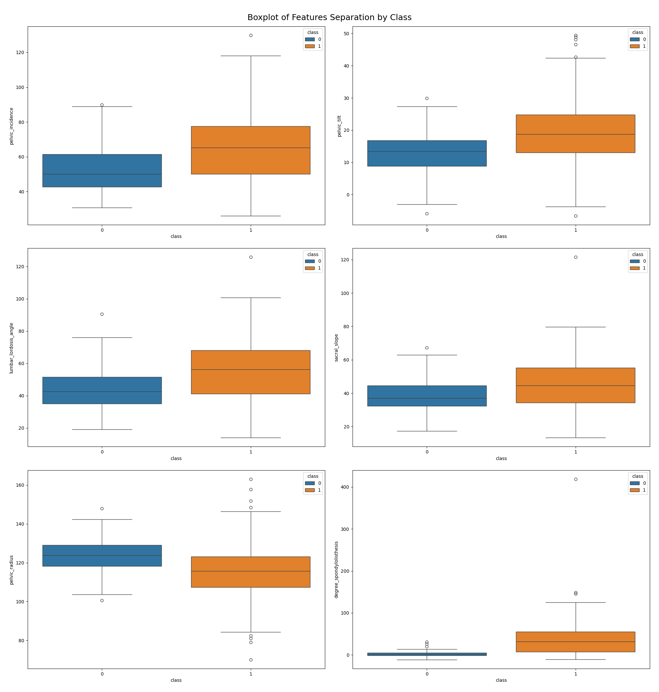
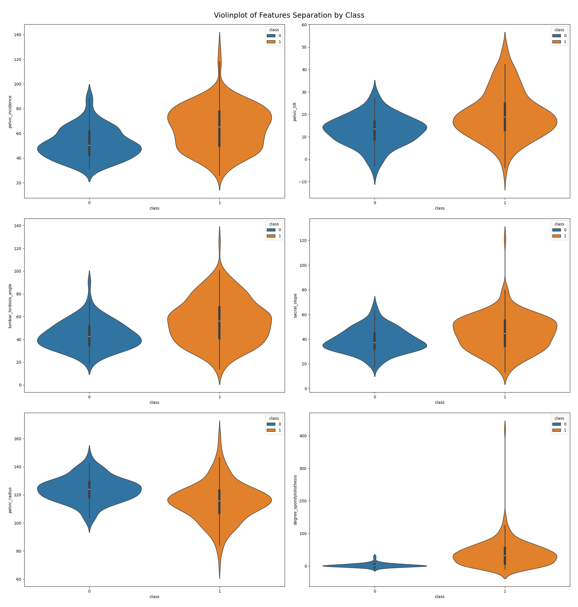

# 📄 SpineScope – Project Report - 🟢 **Beginner Track**

Welcome to your personal project report!  
Use this file to answer the key reflection questions for each phase of the project. This report is designed to help you think like a data scientist, guide AI tools more effectively, and prepare for real-world job interviews.

---

## ✅ Phase 1: Setup & Exploratory Data Analysis (EDA)

    > Answer the EDA questions provided in the project materials here. Focus on data quality, trends, anomalies, and relationships.

    ### 🔑 Question 1: Which features are most strongly correlated with spinal abnormalities?

    ### 🔑 Question 2: Are any features linearly dependent on others (e.g., sacral slope and pelvic incidence)?

    ### 🔑 Question 3: Do biomechanical measurements cluster differently for normal vs. abnormal cases?

    ### 🔑 Question 4: Are there multicollinearity issues that impact modeling?

---

## ✅ Phase 2: Model Development

> This phase spans 3 weeks. Answer each set of questions weekly as you build, train, evaluate, and improve your models.

---

### 🔍 Week 1: Feature Engineering & Data Preprocessing

#### 🔑 Question 1:
Which biomechanical features show the strongest relationship with the target (spinal condition), and how did you determine this?

✏️ Answer:

To identify the biomechanical features most strongly associated with the spinal condition, I combined exploratory analysis, correlation metrics, and statistical testing:

'dataset.groupby('class').mean()' allowed me to compare the average values of each biomechanical feature across the spinal condition classes (normal vs. abnormal). Features with large differences between groups hinted at a strong relationship with the condition.

| class | pelvic_incidence | pelvic_tilt | lumbar_lordosis_angle  | sacral_slope | pelvic_radius | degree_spondylolisthesis  |
|-------|------------------|-------------|------------------------|--------------|---------------|---------------------------|
| 0     | 51.685244        | 12.821414   | 43.542605              | 38.86383     | 123.890834    | 2.186572                  |
| 1     | 64.692562        | 19.791111   | 55.925370              | 44.90145     | 115.077713    | 37.777705                 |

degree_spondylolisthesis (difference ≈ 35.6) shows the largest difference between normal and abnormal classes, indicating a strong association with the spinal condition.

Other notable features:
pelvic_incidence (difference ≈ 13.0)
lumbar_lordosis_angle (difference ≈ 12.4)

'dataset.corr()['class'].sort_values(ascending=False)' calculated the correlation between each numerical feature and the binary-encoded target (e.g., 0 = normal, 1 = abnormal).

| Feature                   | Correlation with Class |
|---------------------------|------------------------|
| class                     | 1.000000               |
| degree_spondylolisthesis  | 0.443687               |
| pelvic_incidence          | 0.353336               |
| pelvic_tilt               | 0.326063               |
| lumbar_lordosis_angle     | 0.312484               |
| sacral_slope              | 0.210602               |
| pelvic_radius             | -0.309857              |

Features like degree_spondylolisthesis and pelvic_incidence had the strongest correlation coefficients, indicating a significant linear relationship with spinal condition.

`boxplot` and `violinplot` helped me visualize how each feature varies across target classes.

Again, features like degree_spondylolisthesis and pelvic_incidence had the strongest difference.

Statistical Testing (t-tests) helped me to confirm that the observed differences were statistically significant. These t-tests tell you which features are statistically different between classes, making them good candidates for modeling or further analysis

| Feature                       | T-Statistic | P-Value     | Interpretation                  |
| ----------------------------- | ----------- | ----------- | ------------------------------- |
| **degree\_spondylolisthesis** | **-8.69**   | **2.2e-16** | 🔥 **Very strongly associated** |
| **pelvic\_radius**            | **+5.72**   | **2.5e-08** | ✅ Strongly associated          |
| **sacral\_slope**             | **-3.78**   | **0.00019** | ⚠️ Moderately associated        |

✅ Interpretation by Feature:
🔥 1. degree_spondylolisthesis
T-statistic = -8.69: Large difference in means between class 0 and 1.

P-value = 2.2e-16: Extremely small — this is not due to chance.

✅ Most strongly associated with spinal condition.

✅ 2. pelvic_radius
T-statistic = +5.72: Clear difference between class groups.

P-value = 2.5e-08: Very small — statistically significant.

✅ Strong association with spinal condition.

⚠️ 3. sacral_slope
T-statistic = -3.78: Moderate difference between groups.

P-value = 0.00019: Still significant (p < 0.05), but weaker than the others.

⚠️ Moderate association with spinal condition.

---

#### 🔑 Question 2:
Before building any model, what patterns or class imbalances did you observe in the target variable? Will this affect your modeling choices?

✏️ Answer:

| class | count |
|-------|-------|
| 1     | 210   |
| 0     | 100   |
Total samples: 310

So, the target variable is imbalanced, with roughly:
32% Normal (Class 0)
68% Abnormal (Class 1)

An imbalanced dataset like this can lead to a biased models, especially when using models that try to maximize overall accuracy. If we do not choose our model wisely, we will have a dumb model that always predicts class 1 (Abnormal):

Recommendation:

1. Evaluation Metrics Beyond Accuracy
Use metrics like:
Precision, Recall, F1-score
Confusion matrix
ROC-AUC

2. Stratified Splits
Use StratifiedKFold or train_test_split(..., stratify=y) to maintain class proportions during training/testing.

3. Resampling Techniques
Oversample minority class (e.g. SMOTE)
Undersample majority class
Or use a balanced-class model (some classifiers like RandomForestClassifier and XGBoost can handle this with a class_weight='balanced' or scale_pos_weight parameter).

4. Algorithm Choice
Tree-based models (Random Forest, XGBoost) are more robust to imbalance.
Logistic regression or SVM may need class weights.

---

#### 🔑 Question 3:
    **Which features appear skewed or contain outliers, and what transformations (if any) did you apply to address them?**  

    💡 **Hint:**  
    Use `.hist()`, `df.skew()`, or boxplots.  
    Try log-transform or standardize features if skewed.  
    Consider z-score or IQR for outlier detection.

    ✏️ *Your answer here...*

---

#### 🔑 Question 4:
    **What scaling method did you apply to your numerical features, and why was it necessary (or not) for the algorithms you plan to use?**  

    💡 **Hint:**  
    Logistic regression and distance-based models require scaling.  
    Tree-based models do not.  
    Use `StandardScaler` or `MinMaxScaler` as needed. Justify your choice.

    ✏️ *Your answer here...*

---

#### 🔑 Question 5:
    **Did you create any new features that might help distinguish between different spinal conditions? If yes, what are they and what was the reasoning behind them?**  

    💡 **Hint:**  
    Try feature ratios or differences, like `pelvic_incidence - pelvic_tilt`.  
    Use domain insight or trial-and-error to create potentially useful features.

    ✏️ *Your answer here...*

---

### 📆 Week 2: Model Development & Experimentation

#### 🔑 Question 1:

#### 🔑 Question 2:

#### 🔑 Question 3:

#### 🔑 Question 4:

#### 🔑 Question 5:

---

### 📆 Week 3: Model Tuning

#### 🔑 Question 1:

#### 🔑 Question 2:

#### 🔑 Question 3:

#### 🔑 Question 4:

#### 🔑 Question 5:

---

## ✅ Phase 3: Model Deployment

    > Document your approach to building and deploying the Streamlit app, including design decisions, deployment steps, and challenges.

    ### 🔑 Question 1:

    ### 🔑 Question 2:

    ### 🔑 Question 3:

    ### 🔑 Question 4:

    ### 🔑 Question 5:

---

## ✨ Final Reflections

    > What did you learn from this project? What would you do differently next time? What did AI tools help you with the most?

    ✏️ *Your final thoughts here...*

---
