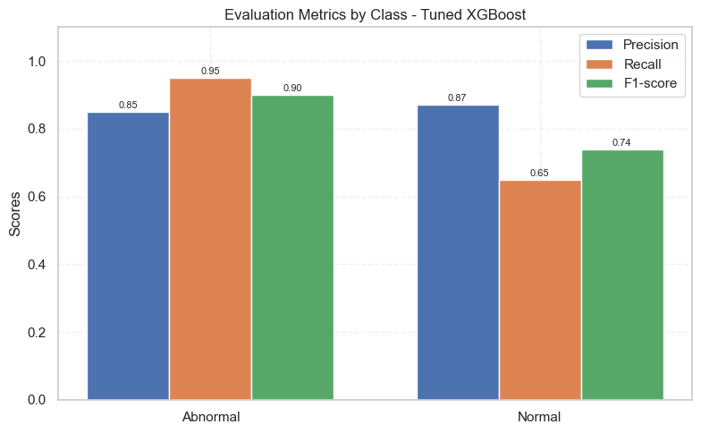
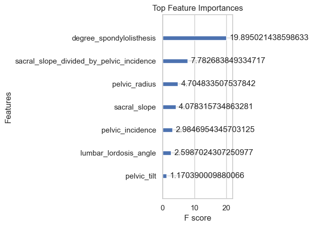
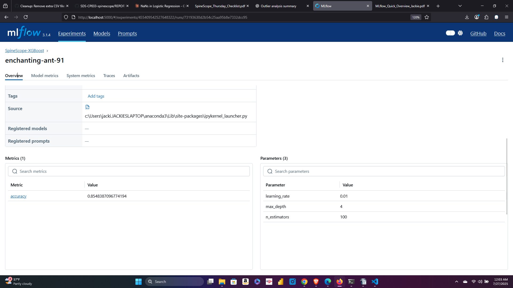
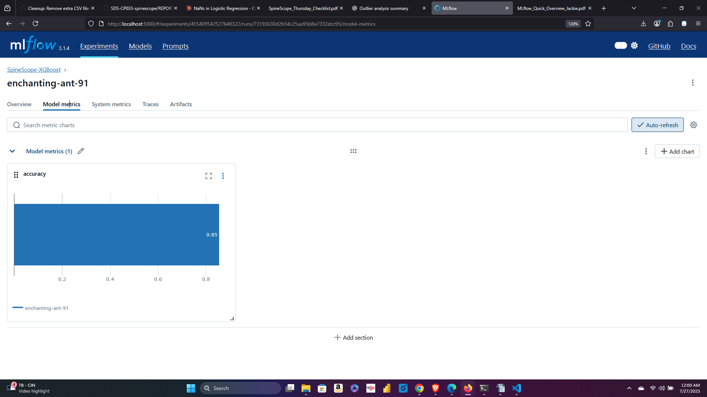

# 📁 SpineScope Phase 2 - Week 3

## 👩‍💻 Jackie CW Vescio

---

## ✅ Question 1: What models did you try and why?

We explored three machine learning classification models to determine the best fit for our spinal abnormality classification problem:

1. **Logistic Regression**
   - Chosen for its simplicity and interpretability.
   - Effective baseline for binary classification tasks.

2. **Random Forest Classifier**
   - Chosen for its ensemble learning power and ability to handle feature importance.
   - Robust to overfitting due to averaging over many decision trees.

3. **XGBoost Classifier**
   - Chosen for its performance with structured data and strong regularization.
   - Tends to outperform other algorithms in tabular datasets.

```python
# Example code used to train the tuned XGBoost model:
from xgboost import XGBClassifier

xgb_tuned = XGBClassifier(learning_rate=0.01, max_depth=4, n_estimators=100, random_state=42)
xgb_tuned.fit(X_train, y_train)
```

---

## 📊 Question 2: What evaluation metrics did you use and how did each model perform?

We used the following metrics for model evaluation:

- **Accuracy**: Overall correctness.
- **Precision**: Correct positive predictions.
- **Recall**: Coverage of actual positives.
- **F1-score**: Balance between precision and recall.
- **Confusion Matrix**: Class-wise prediction breakdown.

### ✅ Final Tuned XGBoost Results:

- **Accuracy**: 0.8548
- **Precision**: Abnormal (0.85), Normal (0.87)
- **Recall**: Abnormal (0.95), Normal (0.65)
- **F1-score**: Abnormal (0.90), Normal (0.74)



---

## 🔍 Question 3: Do any of your models show signs of overfitting or underfitting?

We observed **moderate overfitting** in earlier models such as Random Forest. However, the final tuned **XGBoost** model showed **balanced performance** with only minor overfitting.

We confirmed this using a **learning curve** to visualize performance:

- Training accuracy was consistently high.
- Validation accuracy stabilized, suggesting good generalization.

Causes of prior overfitting included limited dataset size and model complexity. Remedies included:

- Hyperparameter tuning via `GridSearchCV`
- Simpler model architecture (e.g., shallower trees)
- Cross-validation

---

## 📈 Question 4: Which features contributed the most?

Using `.feature_importances_`, we plotted the top predictors from the XGBoost model.

```python
import matplotlib.pyplot as plt

plt.figure(figsize=(8,6))
importance = best_model.feature_importances_
sorted_idx = importance.argsort()[::-1]
top_features = X_train.columns[sorted_idx]

plt.barh(top_features[:10][::-1], importance[sorted_idx][:10][::-1])
plt.xlabel("Feature Importance")
plt.title("Top Feature Importances (XGBoost)")
plt.tight_layout()
plt.show()
```



---

## 🧠 Question 5: How did you use MLFlow to track experiments?

MLFlow was used to:

- Track model parameters (learning rate, depth, etc.)
- Log accuracy scores
- Save the final trained model artifact
- Launch a visual UI to compare experiment runs

We logged experiments using:

```python
import mlflow
import mlflow.sklearn

with mlflow.start_run():
    mlflow.log_param("learning_rate", 0.01)
    mlflow.log_param("max_depth", 4)
    mlflow.log_param("n_estimators", 100)
    mlflow.log_metric("accuracy", 0.8548)
    mlflow.sklearn.log_model(best_model, artifact_path="xgb_model")
```

Accessing `http://localhost:5000` allowed us to inspect and compare experiments via the MLFlow UI.

### Parameters Logged:



### Model Metrics:



---

## 🧾 Summary

- XGBoost with hyperparameter tuning gave the best results.
- Learning curve and confusion matrix helped identify and mitigate overfitting.
- MLFlow enhanced experiment tracking and reproducibility.